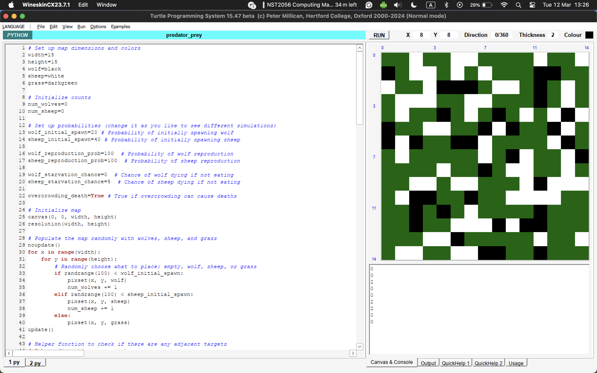
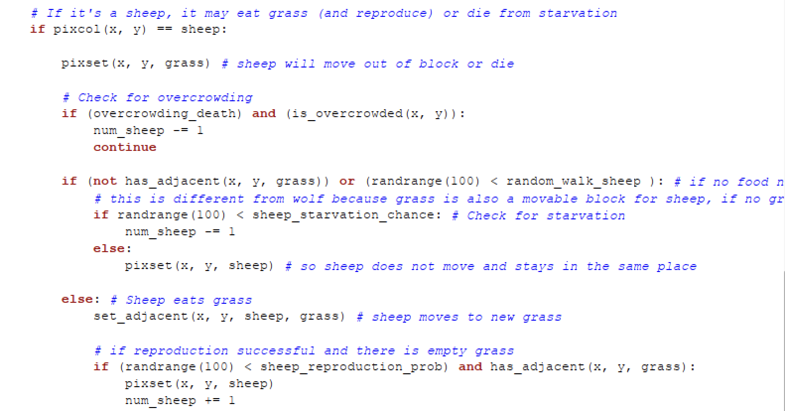

# Explanation of the Predator-Prey Simulation Algorithm

## Introduction

The provided algorithm simulates a predator-prey ecosystem within a grid environment, where wolves (predators) and sheep (prey) interact with each other and with their environment, represented by grass. This simulation is a simplified model of real-world ecological dynamics, capturing essential aspects like **reproduction, starvation, and overcrowding**.

## Environment Setup

The simulation environment is a **20x20 grid** where each cell can contain a wolf, a sheep, grass, or be empty. The initial population of wolves and sheep is determined randomly based on predefined spawn probabilities:

| Populating the map

- Wolves have a _w%_ chance of spawning in any given cell. You can change _w_ to fit your demostration.
- Sheep have a _s%_ chance of spawning in any given cell. You can change _s_ to fit your demostration.
- Cells that don't spawn wolves or sheep are filled with grass.

| Reproduction

- Wolves have a _wr%_ chance of reproducing if it has eaten a sheep and there is an adjacent wolf. You can change _wr_ to fit your demostration.
- Sheep have a _sr%_ chance reproducing if it has eaten grass and there is an adjacent sheep. You can change _sr_ to fit your demostration.

| Starvation

- Wolves have a _ws%_ chance of dying from starvation if it does not eat a sheep. You can change _ws_ to fit your demostration.
- Sheep have a _ss%_ chance of dying from starvation if it does not eat grass. You can change _ss_ to fit your demostration.

| Overcrowding

- Wolves and Sheep can die from overcrowding. You can set `overcrowding_death` to False to remove deaths from overcrowding.

This setup creates a diverse environment where the initial number of entities varies with each simulation run, introducing variability and mimicking natural ecosystems' unpredictability.

## Entity Behavior

### Wolves (Predators)

Wolves move through the grid, seeking adjacent sheep to eat. If a sheep is found in a neighboring cell, the wolf moves to that cell, consuming the sheep, which is then removed from the grid. If no adjacent sheep are available, wolves have an _ws%_ chance of starving and are removed from the grid if they don't eat a sheep.

After eating a sheep a wolf can reproduce if there's another wolf in an adjacent cell and an empty cell nearby to place the new wolf. The reproduction probability is _wr%_, reflecting the challenges in offspring survival.

### Sheep (Prey)

Sheep behave similarly to wolves but seek grass instead of other entities. If adjacent grass is available, a sheep will move to that cell, consuming the grass. If no grass is nearby, sheep have an _ss%_ chance of starving.

After eating grass, sheep reproduction follows the same rules as wolves, with a _sr%_ chance if another sheep is adjacent and there's available space.

### Overcrowding

Both wolves and sheep face the risk of death due to overcrowding. If more than three wolves or sheep are adjacent to a cell, the entity in that cell dies, simulating natural mechanisms where high population density can lead to increased competition for resources and higher mortality rates.

## Initial Setup of Envionment



In the image above, we see that we have populated the environment. Our parameter are as follows.

```
wolf_initial_spawn=3 # Probability of initially spawning wolf
sheep_initial_spawn=25 # Probability of initially spawning sheep
wolf_reproduction_prob=20  # Probability of wolf reproduction
sheep_reproduction_prob=15  # Probability of sheep reproduction
wolf_starvation_chance=15  # Chance of wolf dying if not eating
sheep_starvation_chance=5  # Chance of sheep dying if not eating
```

Each number represents the likelihood that an event happens. For example, `wolf_initial_spawn=3` means that there is a `3%` chance that a wolf will spawn into any grid.

## Simulation Loop

The simulation progresses in cycles, where each cycle involves randomly selecting a grid cell and executing the behavior logic for the entity in that cell. This process includes movement, eating, potential starvation, reproduction, and overcrowding checks.

The simulation continues as long as there are **BOTH** wolves and sheep present in the grid, reflecting an ongoing ecosystem. However, if one species goes extinct, the dynamics change significantly, demonstrating the interdependence of species within ecosystems.

In the case the sheep goes extinct, the wolves cannot find prey to eat, and therefore will eventually go extinct. However, assuming that plants will never go extinct (the case is very rare), the sheep can still coexist alongside the plants in an equilibrium.

## Simulation Environment Variations

To explore different ecological dynamics, we can adjust the simulation parameters. Here are three sets of values designed to simulate various environmental conditions:

### Set 1: Stable Ecosystem

- `wolf_initial_spawn`: 3% - A lower initial wolf population to reduce predation pressure.
- `sheep_initial_spawn`: 25% - A higher initial sheep population ensures ample food for wolves.
- `wolf_reproduction_prob`: 4% - A moderate wolf reproduction rate to maintain population balance.
- `sheep_reproduction_prob`: 15% - A higher sheep reproduction rate supports predator sustenance.
- `wolf_starvation_chance`: 15% - A lower chance of wolf starvation indicates sufficient prey availability.
- `sheep_starvation_chance`: 5% - A lower chance of sheep starvation suggests abundant grass.

This configuration aims to create a balanced ecosystem where both predator and prey populations can sustain themselves over time.

### Set 2: Predator-Heavy Environment

- `wolf_initial_spawn`: 10% - A higher initial wolf population increases predation.
- `sheep_initial_spawn`: 15% - A lower initial sheep population introduces more competition among wolves.
- `wolf_reproduction_prob`: 8% - An increased wolf reproduction rate to test the impact on prey.
- `sheep_reproduction_prob`: 10% - A moderate sheep reproduction rate under higher predation pressure.
- `wolf_starvation_chance`: 30% - A higher chance of wolf starvation due to increased competition.
- `sheep_starvation_chance`: 20% - An increased chance of sheep starvation as they are more likely to be preyed upon.

This set represents an environment where predators are more dominant, potentially leading to rapid prey depletion and higher starvation risks for predators.

### Set 3: Prey-Heavy Environment

- `wolf_initial_spawn`: 2% - A very low initial wolf population minimizes predation pressure.
- `sheep_initial_spawn`: 30% - A very high initial sheep population could lead to overgrazing.
- `wolf_reproduction_prob`: 5% - A moderate wolf reproduction rate in a prey-rich environment.
- `sheep_reproduction_prob`: 20% - A very high sheep reproduction rate could lead to population booms.
- `wolf_starvation_chance`: 10% - A lower chance of wolf starvation due to abundant prey.
- `sheep_starvation_chance`: 5% - A lower chance of sheep starvation, assuming grass is plentiful.

This configuration simulates an environment where prey is abundant, potentially leading to overgrazing and subsequent challenges for the prey population.

## Conclusion

This algorithm offers a simplified yet insightful representation of predator-prey dynamics, illustrating how individual behaviors can lead to complex system-level behaviors in ecology. By adjusting parameters like spawn probabilities and starvation chances, users can explore different ecological scenarios, gaining a deeper understanding of the delicate balance within natural ecosystems.

## How the code works!

### Helper Function

| has_adjacent(x, y, target)


This methods takes in a coordinate x, y and a target to checks whether there are any matching targets around the block. Imagine you are in the centre of a 3X3 grid, we check the surrounding 8 blocks for any that matches the target. The target can either be **grass, sheep or wolf**. It returns True if target exists, else False. As shown below:


| is_overcroweded(x, y)


This method takes in coordinates x, y and checks if there are more than 3 wolves **OR** sheep in the surrounding blocks. If condition is fulfilled, it will return True, else False.

| set_adjacent(x, y, target, source)


This method takes in coordinates x, y as well as the target and source. It checks if any surrounding blocks match the source and replaces it with target. It does this by checking through every surrounding block and appending the coordinate of the blocks that match source into a list. The index is then randomised to pick a random valid source to be replaced with target. This allows the animals (wolf/sheep) to perform a random walk. Returns True is random walk is succesful, else False.

### Main Algorithm


- First, we initialise a cycle variable to count the number of time the loop has ran. Then we have a while loop that checks if there are any wolf **AND** any sheep, the algorithm only stops once one species has gone extinct.

- For each run loop, we set a random coordinate x, y and simulates any action on that grid, if it was a wolf or a sheep.


- This section of code will be ran if the block is a wolf.
- First, we set the current block to become grass, since the wolf will likely die or move to another block after the loop.
- We then check if there is overcrowding using the `is_overcrowded()` helper function.
- We also check if there is food nearby using the `has_adjacent()` helper function, and we proceed starve if we do not have food. There is a probability here that the wolf will die.
- If there is food, then the wolf will move to the sheep block to consume it. The sheep will be eaten and number of sheep will decrease by 1.
- Next, if the wolf is next to another wolf, there is a chance for it reproduce. If reproduction is successful, a wolf will be added to a adjacent grass block.



- This section of code will be ran if the block is a sheep.
- First, we set the current block to become grass, since the sheep will likely die or move to another block after the loop.
- We then check if there is overcrowding using the `is_overcrowded()` helper function.
- We also check if there is food nearby using the `has_adjacent()` helper function, and we proceed starve if we do not have food. There is a probability here that the sheep will die.
- If there is food, then the sheep will move to the grass block to consume it.
- Next, if the sheep is next to another sheep, there is a chance for it reproduce. If reproduction is successful, a sheep will be added to a adjacent grass block.
