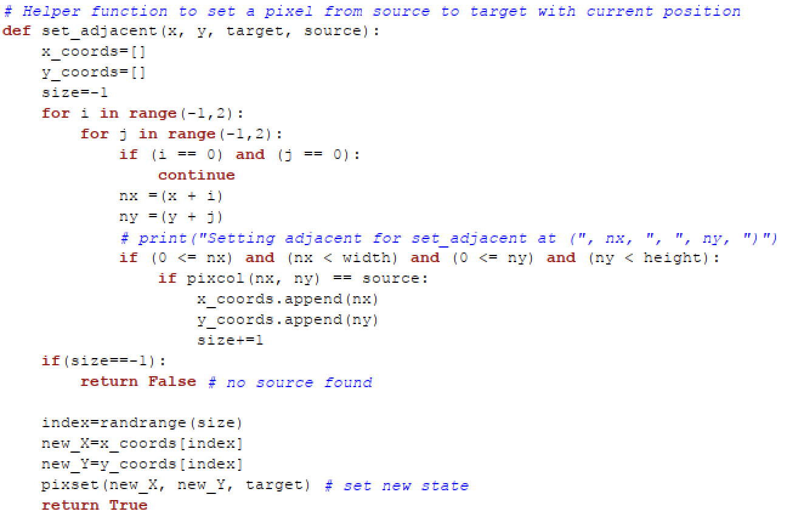

# Explanation of the Predator-Prey Simulation Algorithm

## Introduction

The provided algorithm simulates a predator-prey ecosystem within a grid environment, where wolves (predators) and sheep (prey) interact with each other and with their environment, represented by grass. This simulation is a simplified model of real-world ecological dynamics, capturing essential aspects like **reproduction, starvation, and overcrowding**.

## Environment Setup


The simulation environment is a **nxm grid** where each cell can contain a wolf, a sheep or grass. The initial population of wolves and sheep is determined randomly based on predefined spawn probabilities:


| Populating the map

- Wolves have a chance of spawning in any given cell.
- Sheep have a chance of spawning in any given cell.
- Cells that don't spawn wolves or sheep are filled with grass.

| Reproduction

- Wolves have a chance of reproducing if it has eaten a sheep and there is an adjacent wolf.
- Sheep have a chance reproducing if it has eaten grass and there is an adjacent sheep.

| Starvation

- Wolves have a chance of dying from starvation if it does not eat a sheep.
- Sheep have a chance of dying from starvation if it does not eat grass.

| Random Consumption

- Wolves have a chance of not consuming a sheep even when there is an adjacent sheep.
- Sheep have a chance of not consuming a grass even when there is an adjacent grass.

| Overcrowding

- Wolves and Sheep can die from overcrowding. You can set `overcrowding_death` to False to remove deaths from overcrowding.

This setup creates a diverse environment where the initial number of entities varies with each simulation run, introducing variability and mimicking natural ecosystems' unpredictability.

## Entity Behavior

### Wolves (Predators)

Wolves move through the grid, seeking adjacent sheep to eat. If a sheep is found in a neighboring cell, the wolf moves to that cell, consuming the sheep, which is then removed from the grid. If no adjacent sheep are available, wolves have a chance of starving and are removed from the grid if they don't eat a sheep.

After eating a sheep a wolf can reproduce, the offspring will be spawned at the wolf's original position before it moved to eat the sheep.

### Sheep (Prey)

Sheep behave similarly to wolves but seek grass instead of other entities. If adjacent grass is available, a sheep will move to that cell, consuming the grass. If no grass is nearby, sheep have a chance of starving.

After eating grass, sheep reproduction follows the same rules as wolves, a chance to reproduce if there's available space.

### Overcrowding

Both wolves and sheep face the risk of death due to overcrowding. If more than three wolves or sheep are adjacent to a cell, the entity in that cell dies, simulating natural mechanisms where high population density can lead to increased competition for resources and higher mortality rates.

## Initial Setup of Envionment


In the image above, we see that we have populated the environment. Our parameter are as follows.

```
# Set up probabilities (change it as you like to see different simulations)
wolf_initial_spawn=10 # Probability of initially spawning wolf
sheep_initial_spawn=40 # Probability of initially spawning sheep

wolf_reproduction_prob=100  # Probability of wolf reproduction
sheep_reproduction_prob=50  # Probability of sheep reproduction

wolf_starvation_chance=80  # Chance of wolf dying if not eating
sheep_starvation_chance=10  # Chance of sheep dying if not eating

overcrowding_death=True # True if overcrowding can cause deaths

random_walk_wolf=20 # Probability of wolf not eating an adjacent sheep
random_walk_sheep=10 # Probability of sheep not eating an adjacent grass
```

Each number represents the likelihood that an event happens. For example, `wolf_initial_spawn=3` means that there is a `3%` chance that a wolf will spawn into any grid.

## Simulation Loop

The simulation progresses in cycles, where each cycle involves randomly selecting a grid cell and executing the behavior logic for the entity in that cell. This process includes movement, eating, potential starvation, reproduction, and overcrowding checks.

The simulation continues as long as there are **BOTH** wolves and sheep present in the grid, reflecting an ongoing ecosystem. However, if one species goes extinct, the dynamics change significantly, demonstrating the interdependence of species within ecosystems.

In the case the sheep goes extinct, the wolves cannot find prey to eat, and therefore will eventually go extinct. However, assuming that plants will never go extinct (the case is very rare), the sheep can still coexist alongside the plants in an equilibrium.

## Simulation Environment Variations & Expected Outcomes

By adjusting various parameters in the simulation, we can explore how different conditions affect the predator-prey dynamics. Here are some variations and their potential impacts on the ecosystem:

### Variation 1: Increased Wolf Reproduction Probability

- **Parameters**: Increase `wolf_reproduction_prob` significantly.
- **Expected Outcome**: A higher reproduction rate for wolves could lead to a rapid increase in the wolf population. Initially, this might cause a decline in the sheep population as more wolves increase predation pressure. If the sheep population decreases too much, wolves may face starvation, potentially leading to a crash in the wolf population as well.

### Variation 2: Decreased Sheep Starvation Chance

- **Parameters**: Lower the `sheep_starvation_chance`.
- **Expected Outcome**: With a reduced chance of sheep dying from starvation, the sheep population could become more resilient and potentially increase. This might support a larger wolf population in the long term, but if the sheep population grows too large, it could lead to overgrazing and increased competition among sheep.

### Variation 3: Overcrowding Death Disabled

- **Parameters**: Set `overcrowding_death` to False.
- **Expected Outcome**: Disabling death from overcrowding allows both wolf and sheep populations to grow without the constraint of dying due to high population density. This could lead to higher population peaks, but also increase the risk of resource depletion (grass for sheep), which in turn could affect the wolves.

### Variation 4: High Random Walk Probability

- **Parameters**: Increase `random_walk_wolf` and `random_walk_sheep` significantly.
- **Expected Outcome**: With a higher tendency for wolves and sheep to move randomly without consuming available resources, the interaction between predators and prey might decrease. This could lead to less predictable outcomes, potentially allowing both populations to coexist more stably if direct encounters are less frequent.

### Variation 5: High Initial Spawn Rates

- **Parameters**: Increase both `wolf_initial_spawn` and `sheep_initial_spawn`.
- **Expected Outcome**: Starting with higher numbers of wolves and sheep could accelerate the initial dynamics, leading to quicker population changes. The immediate impact would depend on the balance between the species; an overly high initial wolf population might quickly reduce sheep numbers, while too many initial sheep could lead to a delayed but significant increase in wolves.

By experimenting with these variations, observers can gain insights into how different factors influence population dynamics in predator-prey systems. These simulations can serve as a simplified model for understanding more complex ecological and biological systems in the real world.

## Conclusion

This algorithm offers a simplified yet insightful representation of predator-prey dynamics, illustrating how individual behaviors can lead to complex system-level behaviors in ecology. By adjusting parameters like spawn probabilities and starvation chances, users can explore different ecological scenarios, gaining a deeper understanding of the delicate balance within natural ecosystems.

## How the code works!

### Helper Function

| has_adjacent(x, y, target)


This methods takes in a coordinate x, y and a target to checks whether there are any matching targets around the block. Imagine you are in the centre of a 3X3 grid, we check the surrounding 8 blocks for any that matches the target. The target can either be **grass, sheep or wolf**. It returns True if target exists, else False. As shown below:


| is_overcroweded(x, y)


This method takes in coordinates x, y and checks if there are more than 3 wolves **OR** sheep in the surrounding blocks. If condition is fulfilled, it will return True, else False.

| set_adjacent(x, y, target, source)



This method takes in coordinates x, y as well as the target and source. It checks if any surrounding blocks match the source and replaces it with target. It does this by checking through every surrounding block and appending the coordinate of the blocks that match source into a list. The index is then randomised to pick a random valid source to be replaced with target. This allows the animals (wolf/sheep) to perform a random walk. Returns True is random walk is succesful, else False.

### Main Algorithm


- First, we initialise a cycle variable to count the number of time the loop has ran. Then we have a while loop that checks if there are any wolf **AND** any sheep, the algorithm only stops once one species has gone extinct.

- For each run loop, we set a random coordinate x, y and simulates any action on that grid, if it was a wolf or a sheep.


- This section of code will be ran if the block is a wolf.
- First, we set the current block to become grass, since the wolf will likely die or move to another block after the loop.
- We then check if there is overcrowding using the `is_overcrowded()` helper function.
- We also check if there is food nearby using the `has_adjacent()` helper function, and we proceed starve if we do not have food. There is a probability here that the wolf will die.
- If there is food, then the wolf might move to the sheep block to consume it (depending on the value of wolf_random_walk). If the sheep is eaten,the number of sheep will decrease by 1.
- Next, if the wolf has eaten a sheep, there is a chance for it reproduce. If reproduction is successful, a wolf will be added to where the wolf originally was, before it went to eat the sheep.


- This section of code will be ran if the block is a sheep.
- First, we set the current block to become grass, since the sheep will likely die or move to another block after the loop.
- We then check if there is overcrowding using the `is_overcrowded()` helper function.
- We also check if there is food nearby using the `has_adjacent()` helper function, and we proceed starve if we do not have food. There is a probability here that the sheep will die.
- If there is food, then the sheep might move to the grass block to consume it (depending on the value of sheep).
- Next, if the sheep has eaten a grass, there is a chance for it reproduce. If reproduction is successful, a sheep will be added to where the sheep originally was, before it went to eat the grass.
